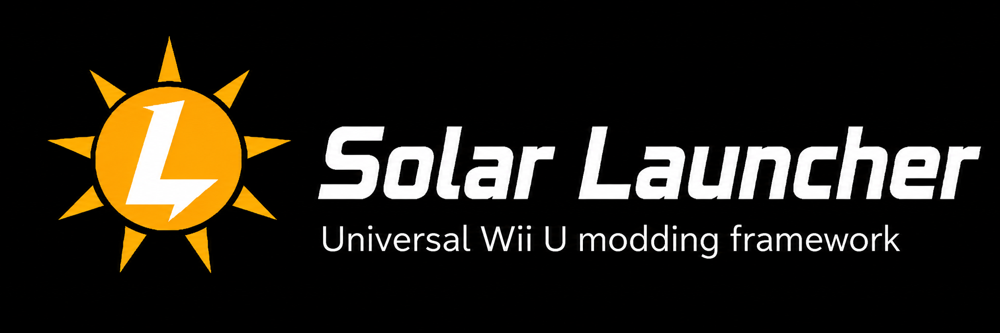

<p align="center">
  
</p>

<h1 align="center">☀️ Solar Launcher</h1>

<p align="center">
  <b>Universal Wii U modding framework for Aroma</b>
</p>

<p align="center">
  Load. Combine. Expand.
</p>

---

## About

**Solar Launcher** is an experimental universal modding framework for the **Wii U**, designed to run under **Aroma**.

The goal is to go beyond traditional file replacement and provide one unified system for loading different kinds of mods.

Solar Launcher is designed to detect the game being launched through its **Title ID**, find compatible mods on the SD card, and allow the user to choose which ones should be enabled.

> ⚠️ Solar Launcher is currently in early development. Most features described below are planned and may not be implemented yet.

---

## ☀️ Goals

Solar Launcher aims to support:

- 🎨 Texture packs
- 📁 File replacement
- 🎵 Custom music and sounds
- ⚙️ Gameplay patches
- 🧠 Memory/function patches
- 🧩 Multiple mods at the same time
- ⚠️ Mod conflict detection
- 📦 SDCafiine-style mod packs
- 🗺️ Custom levels and maps
- 👤 Custom characters
- 🎮 Game-specific mod APIs
- ➕ Advanced addons that can add new content instead of only replacing existing content

---

## 🎮 How it should work

When a compatible Wii U title starts:

```text
Wii U Menu
     ↓
Game launched
     ↓
☀ Solar Launcher
     ↓
Title ID detected
     ↓
Compatible mods found
     ↓
Select enabled mods
     ↓
Apply file replacements / patches / addons
     ↓
Start the game
```

If no compatible mod is installed, the game should simply launch normally.

---

## 🧩 Mod Types

### 📁 File Replacement

The simplest type of Solar mod.

Used for things such as:

- textures
- sprites
- music
- sound effects
- UI
- other game files

The goal is to provide functionality similar to **SDCafiine** while integrating it into the Solar mod manager.

Example:

```text
Original game file:

/vol/content/player/texture.dds

        ↓

Solar replacement:

SD:/wiiu/SolarLauncher/games/TITLE_ID/MyMod/content/player/texture.dds
```

---

### ⚙️ Gameplay Patches

Solar will eventually be able to apply modifications to the running game.

Examples:

- changing gameplay values
- changing player limits
- modifying mechanics
- hooking game functions
- changing game behavior
- memory patches
- function replacement

For example:

```text
Original game:

Maximum Players = 2

        ↓

Solar gameplay patch

        ↓

Maximum Players = 4
```

---

### ➕ Addons

The long-term goal of Solar is to support **real additional content**.

Instead of only replacing:

```text
Original Level
      ↓
Modified Level
```

a Solar addon could potentially allow:

```text
Original Levels
      +
New Fan-Made Level
      +
New Boss
      +
New Character
```

Advanced addon support will require **game-specific Solar APIs/adapters**, because every game handles levels, characters, saves and other content differently.

---

## 📂 Planned SD Structure

```text
SD:/wiiu/SolarLauncher/
├── games/
│   └── TITLE_ID/
│       ├── ModName/
│       │   ├── mod.json
│       │   ├── content/
│       │   ├── patches/
│       │   └── addons/
│       │
│       └── AnotherMod/
│           ├── mod.json
│           ├── content/
│           ├── patches/
│           └── addons/
│
├── config/
├── cache/
└── logs/
```

A basic Solar mod could contain:

```text
MyMod/
├── mod.json
├── content/
├── patches/
└── addons/
```

Example `mod.json`:

```json
{
  "name": "Example Mod",
  "author": "Example Author",
  "version": "1.0.0",
  "titleId": "00050000XXXXXXXX",
  "type": "replacement"
}
```

---

## ☕ SDCafiine Compatibility

One of Solar Launcher's goals is to support existing **SDCafiine-style file replacement packs** whenever possible.

This would allow users to keep using existing Wii U texture and file packs while benefiting from Solar's mod management system.

Solar Launcher is not intended to simply replace SDCafiine, but to build upon the same general idea and extend it toward more advanced types of modding.

Solar could support both structures:

### Solar native mods

```text
SD:/wiiu/SolarLauncher/
└── games/
    └── TITLE_ID/
        └── MyMod/
            ├── mod.json
            └── content/
```

### Existing SDCafiine packs

```text
SD:/wiiu/sdcafiine/
└── TITLE_ID/
    └── MyTexturePack/
        └── content/
```

Solar could detect both automatically.

---

## ⚠️ Mod Conflicts

Solar is planned to detect when multiple mods try to replace the same file.

For example:

```text
HD Texture Pack
└── player/
    └── character.texture

Custom Character
└── player/
    └── character.texture
```

Solar could warn the user:

```text
⚠ MOD CONFLICT DETECTED

2 mods modify:

player/character.texture

Priority:

1. Custom Character
2. HD Texture Pack
```

The mod with the highest priority would be loaded.

This would make it possible to combine multiple mods while reducing unexpected conflicts.

---

## 🪐 Mod Layer System

Solar could treat enabled mods as layers.

For example:

```text
Original Game
     ↓
HD Texture Pack
     ↓
Custom Music Pack
     ↓
Gameplay Mod
     ↓
Custom Character Mod
     ↓
Game starts
```

When multiple mods modify the same resource, Solar would follow the configured priority order.

---

## 🎯 First Advanced Test Project

One of the first advanced projects planned for Solar Launcher is a **3–4 player mod for the Wii U port of Cuphead**.

This project will help test several Solar systems at once:

- additional players
- additional controllers
- gameplay patches
- custom player sprites
- HUD modifications
- file replacement
- game-specific patches

The goal is to expand Cuphead's existing local multiplayer support beyond two players.

Concept:

```text
Player 1 → Cuphead
Player 2 → Mugman
Player 3 → Custom Mugman Variant
Player 4 → Custom Mugman Variant
```

Players 3 and 4 are planned to support custom visual variants based on existing characters.

This project could later serve as an early experiment for a future **Solar Cuphead API** capable of supporting more advanced fan-made content.

Examples could eventually include:

- fan-made levels
- new bosses
- new Run 'n Gun stages
- new playable characters
- custom islands
- new weapons
- new charms
- additional music
- additional visual content

---

## 🌍 Solar Game APIs

Some types of content cannot be loaded universally because every game handles its internal systems differently.

Solar therefore plans to support optional **game-specific APIs/adapters**.

For example:

```text
☀ Solar Launcher
│
├── Solar Cuphead API
├── Solar Mario Kart 8 API
├── Solar Minecraft API
└── Other Game Adapters
```

These adapters could expose systems that mod creators can use without having to manually reverse-engineer every part of a game.

Conceptually, a game API could support actions such as:

```text
RegisterLevel()
RegisterCharacter()
RegisterMap()
RegisterBoss()
RegisterMusic()
RegisterWeapon()
RegisterItem()
```

The exact available functionality would depend on each supported game.

---

## 🗺️ Example: Cuphead Fan-Made Island

A future Cuphead addon could theoretically look like:

```text
FanmadeIsland/
├── addon.json
├── island.json
│
├── levels/
│   ├── boss01/
│   ├── boss02/
│   └── runngun01/
│
├── map/
│   └── island5/
│
├── sprites/
├── music/
└── sounds/
```

For example, `island.json` could describe the additional content:

```json
{
  "name": "Inkwell Island 5",
  "levels": [
    {
      "name": "Clockwork Chaos",
      "type": "boss",
      "path": "levels/boss01"
    },
    {
      "name": "Toon Town Trouble",
      "type": "run_and_gun",
      "path": "levels/runngun01"
    }
  ]
}
```

Solar would detect the addon and use the **Solar Cuphead API** to integrate the additional content into the game.

---

## 🛠️ Development

Solar Launcher is planned around the Wii U **Aroma** environment and the **Wii U Plugin System (WUPS)**.

The project is currently experimental and under active development.

---

## 🗓️ Development Roadmap

### v0.1 — Solar Core

- Title ID detection
- SD mod scanning
- `mod.json` support
- Enable/disable mods
- Basic configuration system
- Basic logging

### v0.2 — File Mods

- File redirection
- Texture/file packs
- Initial SDCafiine compatibility
- Multiple replacement packs
- Basic Solar mod menu

### v0.3 — Mod Management

- Multiple simultaneous mods
- Mod priorities
- Conflict detection
- Better mod metadata
- Dependency support

### v0.4 — Patch Engine

- Memory patches
- Function hooks
- Game/version-specific patches
- Improved debugging and logging

### v0.5 — Advanced Mods

- First advanced gameplay mods
- Initial Cuphead 3-player experiments
- Custom character support

### v0.6 — Cuphead 4 Player

- Four local players
- P3/P4 controller support
- Custom P3/P4 sprites
- HUD extensions
- Camera modifications
- Revive support
- Boss targeting modifications

### Future

- Advanced addons
- Game APIs
- Custom levels
- Custom maps
- Custom characters
- New gameplay content
- Addon dependencies
- Mod profiles
- Community-created Game APIs

---

## 🔧 Planned Solar Architecture

Solar Launcher is planned around several main systems:

```text
☀ Solar Launcher
│
├── Title Manager
│   ├── Detect current game
│   ├── Read Title ID
│   └── Detect game version
│
├── Mod Manager
│   ├── Scan installed mods
│   ├── Read mod.json
│   ├── Enable / disable mods
│   ├── Handle dependencies
│   └── Handle priorities
│
├── Redirect Engine
│   ├── Textures
│   ├── Audio
│   ├── Sprites
│   ├── UI
│   └── Game files
│
├── Patch Engine
│   ├── Memory patches
│   ├── Function hooks
│   ├── Gameplay modifications
│   └── Version-specific patches
│
├── Conflict Manager
│   ├── Detect file conflicts
│   ├── Detect incompatible mods
│   └── Resolve priorities
│
└── Addon Engine
    ├── Game APIs
    ├── Levels
    ├── Maps
    ├── Characters
    ├── Bosses
    └── Additional content
```

---

## ☀️ Solar Launcher Flow

```text
              Wii U Menu
                   │
                   ↓
              Start a Game
                   │
                   ↓
          ☀ Solar Launcher
                   │
                   ↓
           Detect Title ID
                   │
                   ↓
       Search Compatible Mods
                   │
                   ↓
            Solar Mod Menu
                   │
          ┌────────┴────────┐
          │                 │
          ↓                 ↓
     File Mods         Code Patches
          │                 │
          └────────┬────────┘
                   │
                   ↓
              Addons/API
                   │
                   ↓
            Resolve Conflicts
                   │
                   ↓
              Launch Game
```

---

## 📦 Solar Mod Types

Solar Launcher currently plans four main mod categories:

```text
[1] REPLACEMENT
    └── Textures, audio, sprites and game files

[2] PATCH
    └── Memory and gameplay modifications

[3] ADDON
    └── New levels, maps, characters and content

[4] TOTAL MOD
    └── Combination of replacements, patches and addons
```

Example:

```text
Cuphead 4 Player

Type:
TOTAL MOD

Uses:
├── File Replacement
│   └── P3/P4 sprites and HUD
│
├── Gameplay Patches
│   └── 4-player support
│
└── Game API
    └── Cuphead-specific integration
```

---

## 🤝 Contributions

Solar Launcher is intended to become an open modding framework for the Wii U community.

Contributions are welcome in areas such as:

- code
- testing
- documentation
- game research
- mod development
- bug reports
- UI design
- reverse engineering
- ideas
- feature suggestions
- game adapters
- addon development

Every contribution can help expand what is possible on the Wii U.

---

## ❤️ Credits

### ☀️ Project

**Solar Launcher**

Created and led by **[Eitan1414/Pixel Plugin Studios]**

Concept, project direction, testing, design and original idea by the Solar Launcher project creator.

---

### 🤖 Development Assistance

Special thanks to **OpenAI's GPT-5.6 Sol** for development assistance, technical research, brainstorming, architecture design and support throughout the creation of Solar Launcher.

The name **Solar Launcher** is a reference to **GPT-5.6 Sol**, as a small tribute for its help across this project and other Wii U development projects.

> Solar Launcher is an independent community project and is not officially affiliated with or endorsed by OpenAI.

---

### 🛠️ Wii U Homebrew Community

Solar Launcher builds upon years of work from the Wii U homebrew community.

Special thanks to the developers and contributors behind projects and tools such as:

- **Aroma**
- **Wii U Plugin System (WUPS)**
- **wut**
- **devkitPro**
- **devkitPPC**
- **ContentRedirectionModule**
- **FunctionPatcherModule**
- **SDCafiine**
- **FTPiiU Everywhere**

Their work makes projects like Solar Launcher possible and continues to expand what the Wii U can do.

---

### 🎮 Cuphead Wii U

Special thanks to **The Latte Team** for their work on the Wii U port of **Cuphead**, which is planned to serve as one of Solar Launcher's first advanced modding test cases.

The Cuphead 3–4 player project is intended as a community modification and is separate from the original Wii U port.

**Cuphead**, its characters, artwork and related intellectual property belong to **Studio MDHR** and their respective rights holders.

---

### 💙 Community

Thanks to everyone who contributes:

- code
- documentation
- testing
- mods
- game research
- bug reports
- suggestions
- tools
- tutorials

Solar Launcher is intended to grow together with the Wii U modding and homebrew community.

---

## ⚠️ Disclaimer

Solar Launcher is an unofficial homebrew project.

It is not affiliated with or endorsed by:

- Nintendo
- OpenAI
- Studio MDHR
- The Latte Team
- any game publisher or developer unless explicitly stated otherwise

Users should provide their own legally obtained games and game files.

Solar Launcher does not aim to distribute copyrighted game assets.

Game names and trademarks belong to their respective owners.

---

<p align="center">
  ☀️ <b>Solar Launcher</b><br>
  <i>Universal Wii U modding framework</i>
</p>

<p align="center">
  <b>Built for the Wii U modding community.</b>
</p>
